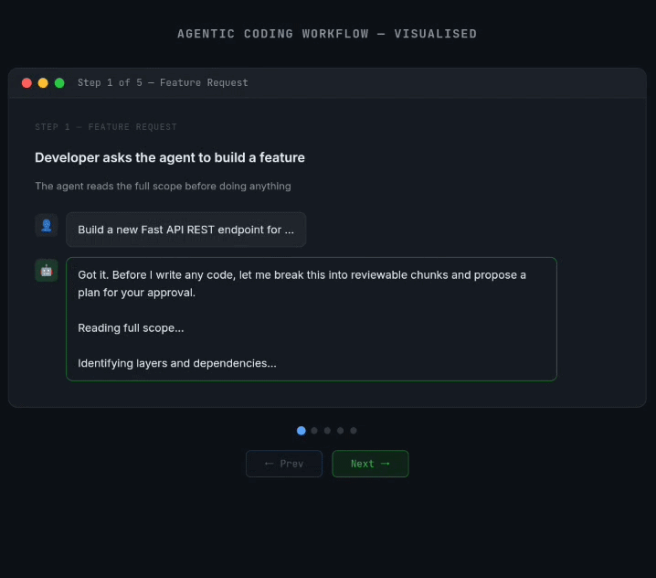

# Your AI Agent Is a 100x Developer. Your Code Review Process Isn't.

AI agents ship code fast. But large unreviewable PRs are the new bottleneck.
This repo contains agent instructions that fix that by making your coding agent
plan, stack, and ship in small reviewable chunks automatically.

---

## The Problem

AI agents complete tasks end-to-end by default - one giant PR, 'n' no. of files,
zero reviewability. Reviewers surrender. Bugs ship. Technical debt accumulates silently.

**The bottleneck didn't disappear. It just moved from writing code to reviewing it.**

---

## The Solution




👉 [Interactive version](https://agentic-coding-workflow.pages.dev/)

Instruct your agent to follow the following workflow:

1. **Propose** a chunk breakdown before writing any code - human approves the plan
2. **Write** the agreed plan to `FEATURE_PLAN.md` in the repo - persistent memory, no drift
3. **Execute** one chunk at a time - one branch, one concern, one PR per chunk, layered on top of the previous chunk
4. **Re-read** `FEATURE_PLAN.md` at the start of every chunk - mandatory, not optional
5. **Confirm** with the human before moving to the next chunk
6. **Review** Each PR is one layer of the feature. Reviewable in minutes, not hours. (*To be reviewed and merged one chunk at a time.*)

---

## Core Principles

- **Plan before code.** No coding until the chunk plan is human-approved.
- **One branch = one concern.** No exceptions.
- **Stacked, not parallel.** Each branch builds on its parent - not all off main.
- **Write it down.** `FEATURE_PLAN.md` is the agent's source of truth, not its memory.
- **Human checkpoints.** Confirm the plan upfront and before each chunk is coded.
- **Small PRs are non-negotiable.** If a chunk feels too big, split it.

---

## Example: For a new REST API endpoint - chunks can look like this:

```js
| Order | Branch | Contains |
|-------|--------|----------|
| 1 | `feat/db-schema` | Schema + migrations only |
| 2 | `feat/validators` | Request/response validators only |
| 3 | `feat/service-layer` | Business logic only |
| 4 | `feat/controller` | Route handlers only |


Hierarchy:
feat/db-schema → main
feat/validators → feat/db-schema
feat/service-layer → feat/validators
feat/controller → feat/service-layer
feat/tests → feat/controller
```

---

## Merging:
Merge the PRs in the order they were created: `feat/db-schema` first since it targets `main`, then `feat/validators`, then `feat/service`, and so on.
Once a PR is merged, GitHub automatically retargets the next PR in the stack to main. This cascades all the way through and no manual retargeting needed.

> ⚠️ A child PR should only be merged after its parent is merged, the cascade enforces the right order naturally.


---


## How to Use

Copy `AGENTS.md` into your repo root with the right filename for your agent:

| Agent | Filename |
|-------|----------|
| Claude Code | `CLAUDE.md` |
| OpenAI Codex CLI | `AGENTS.md` |
| Cursor | `.cursorrules` |
| Windsurf | `.windsurfrules` |
| GitHub Copilot | `.github/copilot-instructions.md` |

That's it. Your agent follows this workflow from the next feature onwards.

---

## Requirements

- [git-town](https://www.git-town.com/install) must be installed in your environment.

## Quick Reference of git-town commands

| Action | Command |
|--------|---------|
| First chunk branch (off main) | `git town hack feat/<n>` |
| Stack next chunk on top | `git town append feat/<n>` |
| Raise PR to immediate parent | `git town propose` |
| Sync current branch from parents | `git town sync` |
| Propagate changes down the stack | `git town sync --stack` |
| Visual stack navigator | `git town switch` |
| Move one level up/down | `git town up` / `git town down` |
| View full stack | `git town status` |

---